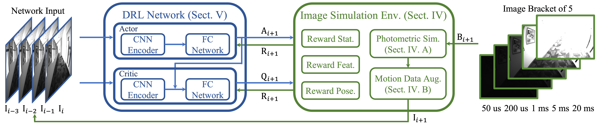
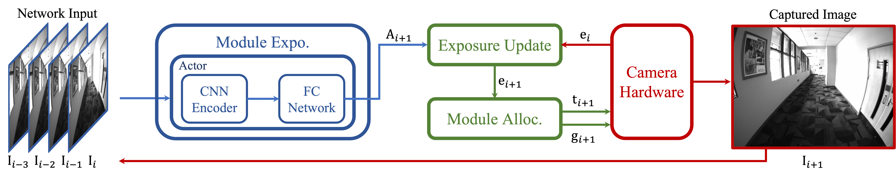
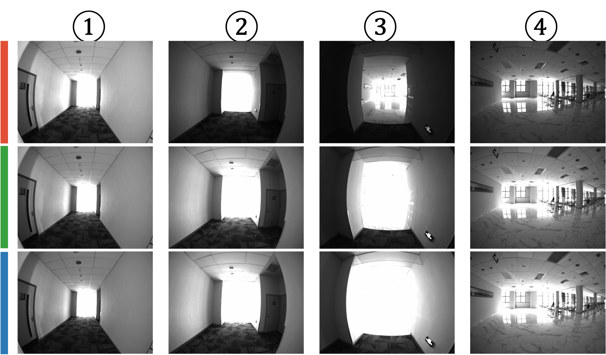
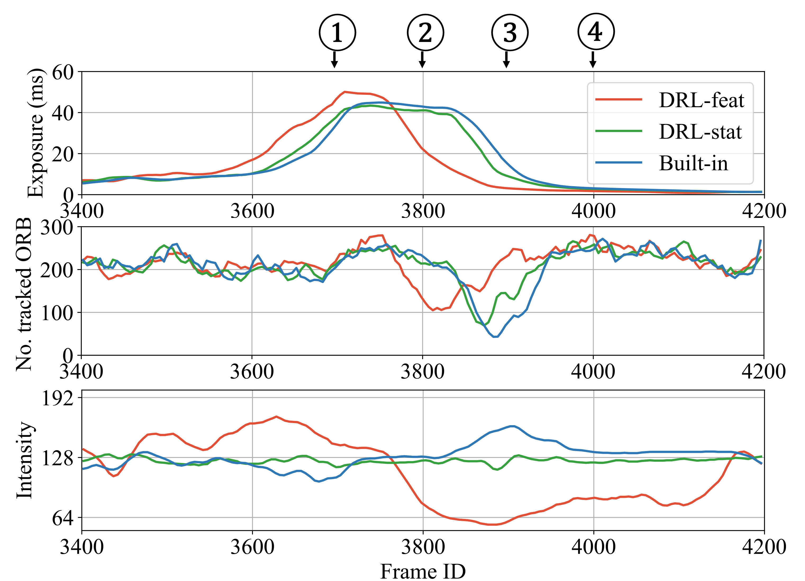

<!--
 * @Author: Shuyang Zhang
 * @Date: 2024-08-25 19:55:54
 * @LastEditors: ShuyangUni shuyang.zhang1995@gmail.com
 * @LastEditTime: 2024-08-25 21:52:52
 * @Description: 
 * 
 * Copyright (c) 2024 by Shuyang Zhang, All Rights Reserved. 
-->
# Efficient Camera Exposure Control for Visual Odometry via Deep Reinforcement Learning

This is an official repository of

**Efficient Camera Exposure Control for Visual Odometry via Deep Reinforcement Learning**, Shuyang Zhang, Jinhao He, Yilong Zhu, Jin Wu, and Jie Yuan.

This paper is currently under review at **IEEE Robotics and Automation Letters (RAL)**.

  

  <strong> Training process. </strong>

  

  <strong> Inference process. </strong>

## Motivations
We want to implement an exposure control method based on deep reinforcement learning (DRL), which
* enables **fast** and **convenient** offline training via a simulation environment;
* adds **high-level information** to make the agent **intelligent** for subsequent visual tasks, for this paper, visual odometry (VO).

## Highlights
* **A DRL-based camera exposure control solution**. The exposure control challenge is divided into two subtasks, enabling completely offline DRL operations without the necessity for online interactions.
* **An lightweight image simulator** based on imaging principles,significantly enhances the data efficiency and simplifies the complexity of DRL training.
* **A study on reward function design** with various levels of information. The trained agents are equipped with different intelligence, enabling them to deliver exceptional performance in challenging scenarios.
* **Sufficient experimental evaluation**, which demonstrates that our exposure control method improves the performance of VO tasks, and achieves faster response speed and reduced time consumption.

  

  

  Our DRL-based method with feature-level rewards~(DRL-feat) exhibits a high-level comprehension of lighting and motion. It predicts the impending over-exposure event and preemptively reduces the exposure. While this adjustment temporarily decreases the number of tracked feature points, it effectively prevents a more severe failure in subsequent frames.

## Run the code

### Setup

### Infer with pre-trained agents

### Train customized agents

## Citation
